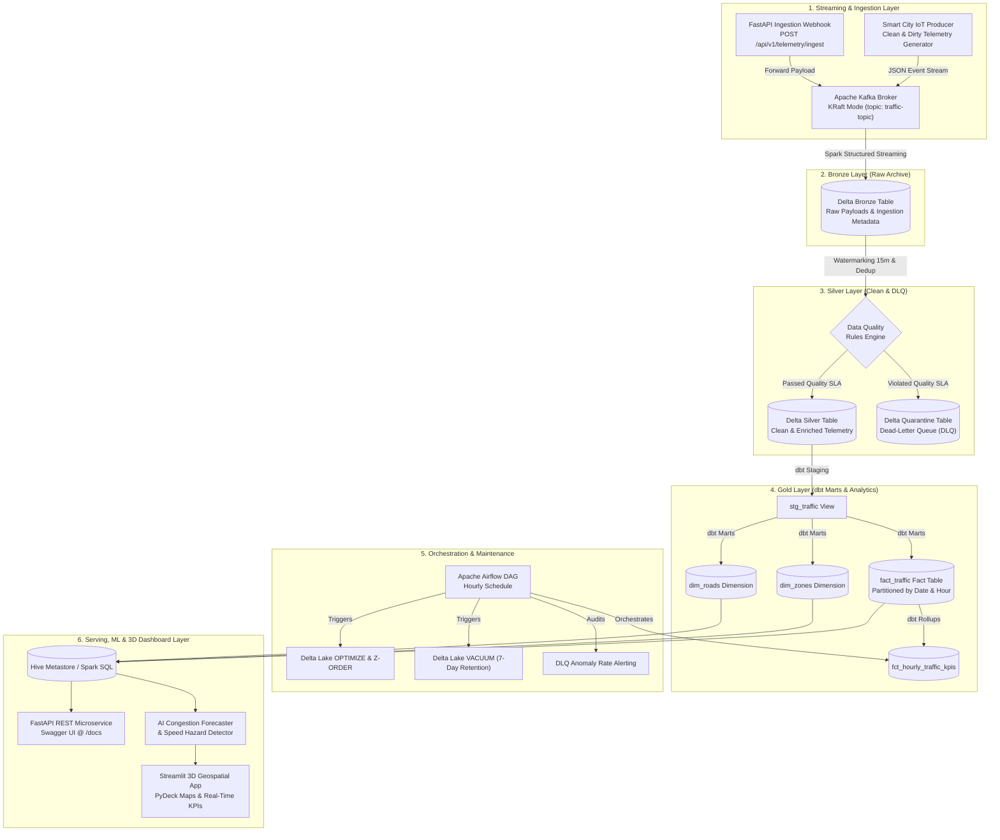

<div align="center">

# 🚦 Smart City Mobility Analytics & Real-Time Lakehouse

### *Enterprise Streaming Telemetry Platform with Medallion Architecture, Dead-Letter Queue (DLQ), AI Congestion Forecasting, dbt Modeling, and Airflow Orchestration*

<!-- Updated: 2026-08-26 | Sole Author & Maintainer: Aditya Mahato -->
[](https://mahatoaditya24-mobility-analytics-lakehous-streamlit-app-vra3rm.streamlit.app/)
[](https://spark.apache.org/)
[](https://delta.io/)
[](https://kafka.apache.org/)
[](https://www.getdbt.com/)
[](https://airflow.apache.org/)
[](https://fastapi.tiangolo.com/)
[](https://www.terraform.io/)
[](https://github.com/)

</div>

---

> 🚀 **Live Interactive Dashboard:** [https://mahatoaditya24-mobility-analytics-lakehous-streamlit-app-vra3rm.streamlit.app/](https://mahatoaditya24-mobility-analytics-lakehous-streamlit-app-vra3rm.streamlit.app/)
>
> 📂 **GitHub Repository:** [https://github.com/mahatoaditya24/Mobility-Analytics-Lakehouse](https://github.com/mahatoaditya24/Mobility-Analytics-Lakehouse)

---

## 📖 Executive Summary

Urban transportation networks generate millions of high-velocity IoT telemetry events every minute. Real-time decision systems (dynamic traffic routing, emergency dispatch, congestion taxation) require **sub-second streaming analytics**, **strict data quality enforcement**, **ACID lakehouse storage**, **dbt semantic modeling**, and **Airflow orchestration**.

This repository implements a production-grade, distributed **Real-Time Data Lakehouse & AI Telematics Platform** processing continuous smart city mobility telemetry. Built on **Apache Kafka (KRaft)**, **Apache Spark 3.5 Structured Streaming**, **Delta Lake 3.2**, **dbt-core**, **Apache Airflow**, **FastAPI**, and **Streamlit**, the platform enforces enterprise data contracts through a **Medallion Architecture (Bronze ➔ Silver + DLQ ➔ Gold Star Schema)**, runs predictive gridlock forecasting, and surfaces actionable intelligence across interactive 3D geospatial dashboards and RESTful endpoints.

---

## 🏗️ System Architecture



---

## 🌟 Full Tech Stack Breakdown

| Layer | Technologies Used | Key Responsibilities |
| :--- | :--- | :--- |
| **Streaming Ingestion** | `Apache Kafka (KRaft)`, `Python Producer` | Sub-100ms IoT telemetry stream ingestion, anomaly generation |
| **Compute & Streaming** | `Apache Spark 3.5`, `PySpark Structured Streaming` | Real-time microbatch processing, 15m watermarking, deduplication |
| **Storage & Lakehouse** | `Delta Lake 3.2`, `Hive Metastore`, `PostgreSQL` | ACID transactions, Medallion tables, Z-Order spatial clustering, Time Travel |
| **Data Transformations** | `dbt-core 1.8` | Modular staging, dimensional marts (`dim_zones`, `dim_roads`), schema tests |
| **Orchestration** | `Apache Airflow 2.9` | Hourly batch DAG, Delta maintenance scheduling, DLQ SLA alert auditing |
| **API Serving** | `FastAPI`, `Uvicorn`, `Pydantic` | Swagger UI (`/docs`), live zone KPIs, RESTful webhook ingestion |
| **AI & Predictive ML** | `Python Inference Engine` | Gridlock risk estimation, speed hazard anomaly detection |
| **Visualization** | `Streamlit`, `PyDeck 3D`, `Plotly` | Live 3D GPS vehicle tracking, congestion heatmaps, SQL workbench |
| **Infrastructure as Code**| `Terraform (AWS)` | Automated provisioning of S3 Data Lake, Glue Catalog, and EMR roles |
| **Testing & CI/CD** | `GitHub Actions`, `Unittest / PyTest` | 21 automated unit tests verifying DQ rules, schemas, and ML inference |

---

## 🛡️ Enterprise Data Quality (DQ) & Dead-Letter Queue (DLQ)

```
                  ┌───────────────────────────────┐
                  │   Incoming Bronze Telemetry   │
                  └───────────────┬───────────────┘
                                  │
                 ┌────────────────▼────────────────┐
                 │     Data Quality Rules Engine   │
                 └───────┬─────────────────┬───────┘
                         │                 │
              [ Passed Quality SLA ]  [ Violated Quality SLA ]
                         │                 │
                         ▼                 ▼
             ┌──────────────────────┐  ┌──────────────────────┐
             │  traffic_silver      │  │  traffic_quarantine  │
             │  (Clean Lakehouse)   │  │  (Dead Letter Queue) │
             └──────────────────────┘  └──────────────────────┘
```

| DQ SLA Rule | Validation Constraint | Quarantine Action |
| :--- | :--- | :--- |
| **Vehicle ID Integrity** | Non-null, non-empty UUID string | Routes to DLQ as `MISSING_VEHICLE_ID` |
| **Speed Boundary** | Real-world physical vehicle limits | `speed < 0 OR speed > 180 km/h` ➔ `SPEED_OUT_OF_BOUNDS` |
| **Timestamp Freshness** | No futuristic timestamps | `event_ts > now() + 10m` ➔ `FUTURE_TIMESTAMP_ANOMALY` |
| **Watermark Latency** | Within acceptable late window | `event_ts < now() - 3 hours` ➔ `EXCESSIVE_LATENCY` |
| **Payload Integrity** | Valid UTF-8 JSON structure | Corrupt hex/binary payloads ➔ `CORRUPT_PAYLOAD` |

---

## ⚡ FastAPI Microservice Endpoints

Interactive Swagger UI available at `http://localhost:8000/docs`:

| Method | Endpoint | Description |
| :--- | :--- | :--- |
| `GET` | `/health` | Lakehouse connection, broker status, and active streaming queries |
| `GET` | `/api/v1/traffic/zones` | Overview of all city zones, active vehicles, velocities, and congestion levels |
| `GET` | `/api/v1/traffic/zones/{id}` | Detailed telemetry metrics for a specific zone |
| `GET` | `/api/v1/quarantine/errors` | Real-time DLQ error taxonomy and recent quarantine log entries |
| `POST` | `/api/v1/predict/congestion` | AI predictive inference: forecasts congestion level & gridlock probability |
| `POST` | `/api/v1/telemetry/ingest` | REST webhook ingesting single telemetry events directly to Kafka |

---

## 🚀 Quickstart & Setup Guide

### 1. Clone and Setup Environment
```bash
git clone https://github.com/mahatoaditya24/Mobility-Analytics-Lakehouse.git
cd Mobility-Analytics-Lakehouse

# Create and activate virtual environment
python -m venv venv
source venv/bin/activate    # On Windows: venv\Scripts\activate

# Install dependencies
pip install -r requirements.txt
```

### 2. Spin Up Infrastructure via Docker
```bash
docker compose up -d
```

### 3. Run Producer & Streaming Pipelines
```bash
# Run IoT generator
python producer/traffic_producer.py --rate 2.5 --dirty-ratio 0.20

# Submit Streaming Pipelines (Bronze, Silver, Gold)
bash scripts/submit_streaming_jobs.sh all
```

### 4. Run dbt Transformations
```bash
cd dbt
dbt run --models marts
dbt test
```

### 5. Launch FastAPI & Streamlit
```bash
# FastAPI Server @ :8000/docs
uvicorn api.main:app --host 0.0.0.0 --port 8000 --reload

# Streamlit Dashboard @ :8501
streamlit run dashboard/app.py
```

---

## 🧪 Automated Testing & CI Pipeline

Run all 21 unit tests locally:
```bash
python -m unittest discover -s tests -p "test_*.py" -v
```

---

## 📂 Repository Structure

```
Mobility-Analytics-Lakehouse/
├── .github/
│   └── workflows/
│       └── ci.yml                 # Automated GitHub Actions CI workflow (21 tests)
├── api/
│   ├── __init__.py
│   ├── main.py                    # FastAPI REST microservice & serving layer
│   └── schemas.py                 # Pydantic schema validation
├── apps/
│   ├── __init__.py
│   ├── config.py                  # Centralized pipeline configuration
│   ├── bronze_layer.py            # Kafka -> Delta Bronze ingestion
│   ├── silver_layer.py            # Bronze -> DQ Validation -> Silver + DLQ
│   ├── gold_layer.py              # Silver -> Star Schema (Fact + Dims)
│   ├── aggregations.py            # Hourly traffic & congestion rollups
│   └── maintenance.py             # Delta OPTIMIZE, Z-ORDER, VACUUM & Time Travel
├── dbt/
│   ├── dbt_project.yml            # dbt project configuration
│   ├── profiles.yml               # Spark Thrift connection profile
│   └── models/
│       ├── staging/               # stg_traffic view and schema tests
│       └── marts/                 # dim_zones, dim_roads, fct_hourly_traffic_kpis
├── orchestration/
│   └── dags/
│       └── mobility_lakehouse_pipeline.py  # Apache Airflow Hourly Orchestration DAG
├── terraform/
│   ├── main.tf                    # AWS S3, EMR, and Glue Metastore IaC
│   ├── variables.tf               # Terraform input parameters
│   └── outputs.tf                 # Terraform output ARNs
├── notebooks/
│   ├── 01_exploratory_data_analysis.ipynb      # Visual EDA & spatial analytics
│   └── 02_delta_lake_time_travel_demo.ipynb    # Delta Lake ACID & Time Travel demo
├── dashboard/
│   └── app.py                     # Streamlit 3D geospatial & AI analytics dashboard
├── docker-compose.yml             # Distributed multi-container infrastructure
├── ml/
│   ├── __init__.py
│   └── congestion_model.py        # AI Congestion Forecaster & Anomaly Detection
├── producer/
│   ├── __init__.py
│   └── traffic_producer.py        # Configurable smart city IoT event producer
├── sql/
│   ├── ddl_schema.sql             # Delta table DDL and Metastore views
│   └── analytical_kpis.sql        # High-performance analytical queries
├── tests/
│   ├── test_producer.py           # Unit tests for event generator
│   ├── test_data_quality.py       # Unit tests for DQ & DLQ engine
│   ├── test_transformations.py    # Unit tests for feature engineering
│   ├── test_ml_model.py           # Unit tests for AI prediction & anomaly engine
│   └── test_api.py                # Unit tests for FastAPI endpoints & schemas
├── streamlit_app.py               # Root entrypoint for Streamlit Cloud
├── app.py                         # Root alias entrypoint
├── Makefile                       # Convenience make targets
├── requirements.txt               # Web & API Python dependencies
├── requirements-pipeline.txt      # Full PySpark/Delta pipeline dependencies
└── RESUME_BULLETS.md              # CV / Resume bullet points & interview guide
```

---

## 📄 License

This project is licensed under the [MIT License](LICENSE).
